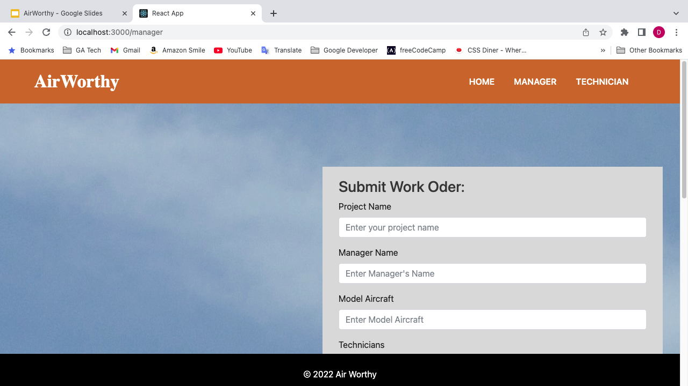
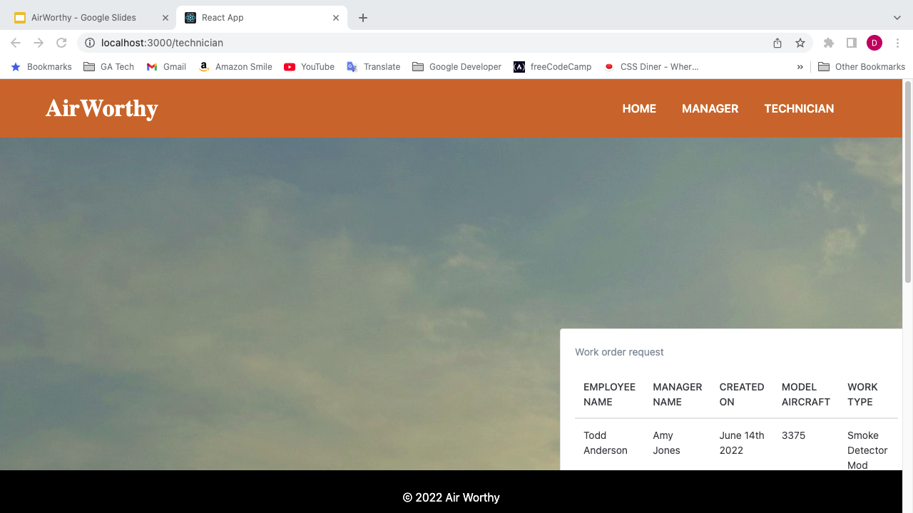

> # <center><a style="text-align: center;font-family: sans-serif;font-size: 4.5rem;letter-spacing: 0.18rem;text-transform: uppercase;color: #fff;text-shadow: -4px 4px #ef3550,-8px 8px #f48fb1,-12px 12px #7e57c2,-16px 16px #2196f3,-20px 20px #26c6da,-24px 24px #43a047,-28px 28px #eeff41,-32px 32px #f9a825,-36px 36px #ff5722;margin-bottom: 10px"> AirWorthy </a> 
> <br></br>
> # <center> <h1 name="TableOfContents" id ="Toc" className="TOC_BODY" style="clear: both; display: table; content:; width: 50%; color:#AF1; font-size: 2.45rem;border-radius: 23%;border: dotted; padding: 10px; margin: auto; align-content: center; "> Table of Contents </h>
>> 1. [Description](#Description)
>> 2. [Task](#Task)
>> 3. [Technologies](#Technologies) 
>
> # <center> <a name="Descriptption" id ="Description" className="TOC_ITEM" style="color:#CD4"> Application Description </a>
> <a name="MERN" id="Mern" className="COMMON" style="color:#DB1;text-align:center;font-weight: 10;"> A full stack MERN application that uses an authentication system to allow FAA Inspectors, Airliners, and Aircraft Technicians to update progress on their work all while keeping a log of records on projects completed. </a>
> 
> ```md > LICENSE > 
> # License
> ```
> # <a name="Task" id ="Task" className="TOC_ITEM" style="color:#FA3">The Task</a>
> ```md
> The full-stack MERN application had to meet the following requirements:
>
> 1. Use React for the front end. 
> 2. Use GraphQL with a Node.js and Express.js server.
> 3. Use MongoDB and the Mongoose ODM for the database.
> 4. Use queries and mutations for retrieving, adding, updating, and deleting data.
> 5. Be deployed using Heroku (with data).
> 6. Have a polished UI.
> 7. Be responsive.
> 8. Be interactive (i.e., accept and respond to user input).
> 9. Include authentication (JWT).
> 10. Protect sensitive API key information on the server.
> 11. Have a clean repository that meets quality coding standards (file structure, naming conventions, best practices for class and id naming conventions, indentation, high-quality comments, etc.).
> 12. Have a high-quality README (with unique name, description, technologies used, screenshot, and link to deployed application).
> ```
> ## <a name="Technologies" id ="Technologies" className="TOC_ITEM" style="color:red">Technologies Used</a>
>
>> ### Application
>> * concurrently
>
>> ### Client
>> * @testing-library/jest-dom
>> * @testing-library/react-testing-library
>> * bootstrap
>> * jQuery
>> * auth0/jwt-decode
>> * lokesh/lightbox2
>> * sass/node-sass
>> * necolas/normalize.css
>> * floating-ui/popper.js
>> * facebook/react-dom
>> * facebook/create-react-app
>> * remix-run/react-router-dom
>> * webpack-contrib/sass-loader
>> * mattboldt/typed.js
>> * GoogleChrome/web-vitals
>
> ### Server
>> 1. apollographql/apollo-server
>> 2. kelektiv/node.bcrypt.js
>> 3. bootstrap
>> 4. snetz/cjs
>> 5. **expressjs/express**
>> <emp>_`minimal and flexible Node.js web application framework that provides a robust set of features for web and mobile applications.  HTTP utility methods and middleware at your disposal, creating a robust API is quick and easy.`_</emp>
>> * graphql/graphql-js
>> * auth0/node-jsonwebtoken
>> * Automattic/mongoose
>> * remy/nodemon
>
>> ## Technology Implementation
>>> 1. **Apollo**
>>> <emp>_`Apollo will work with the graphql schema and the backed graphl api to work with the front end technologies.`_</emp>
>>>> - <u>**Defining the schema**</u>: Identify which data our feature requires, and then we structure our schema to provide that data as intuitively as possible.
>>>> - <u>**Backend implementation**</u>: Build out GraphQL API with Apollo Server & fetch required data from data sources containing it. Then, connect app to a live REST data source.
>>>> - <u>**Frontend implementation**</u>: Client consumes data from our GraphQL API to render its views.
>
>
>> ## User Story
> AS AN FAA inspector 
> ------------------------
>> I WANT to have a central database
>> SO THAT I maintain the authenticity of work from certified and uncertified technicians.
>
> AS AN Airline Company 
> ------------------------
>> I WANT to have a central database
>> SO THAT I am be able to track the progress of the teams that are assigned to maintenance of our aircraft.
>
> AS AN Aircraft Maintenance Technician 
> ------------------------
>> I WANT to be able to see the projects I am working on and assigned to
>> SO THAT I can log my work history to log my time as I complete the work I do ?on the aircraft.
> ## Acceptance Criteria
>
> ```md
> GIVEN an airplane maintenance database
> WHEN I load the search engine
> THEN I am presented with a menu with the options to Login or Signup
> WHEN I am not on the home page
> THEN I am given the option to return there
> WHEN I log in as a high-level user
> THEN I can see a list of projects, managers, technicians, issues, aircraft and completion statuses
> WHEN I add something to the database
> THEN the new information can be seen in the database
> WHEN I update anything in the database
> THEN those changes are made in the database
> WHEN I delete something from the database
> THEN that information is no longer accessible
> WHEN I log in as a low-level user
> THEN I can see a list of the projects to which I am assigned
> ```
> ## Screenshot
>
> Landing Page:
> 
>
> Manager Interface:
> 
>
> Technician Interface:
> 
>
> ## GitHub Repository & Deployed Application (Heroku)
>
> * GitHub Repository: <https://github.com/BinaryBitBytes/AirWorthy>
> * Deployed Application: <https://air-worthy.herokuapp.com/>
>